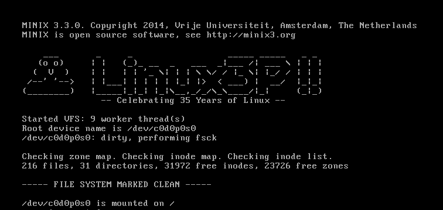

# Modify the kernel

Under `/minix/minix/kernel/main.c`, make your own modification in:

```c
static void announce(void)
{
    ...
}
```

to customise the startup banner.

Then rebuild the kernel:

```bash
cd releasetools
nbmake-i386 hdboot
```

If successful,

```text
../obj/destdir.i386/boot/minix/.temp
```

will contain your custom kernel and boot modules.

Change into the `.temp` directory:

```bash
cd ../obj/destdir.i386/boot/minix/.temp
```

Then run QEMU again:

```bash
qemu-system-i386 \
  -cpu host \
  -m 1024 \
  -enable-kvm \
  -machine hpet=off \
  -drive file=/path/to/minix3_dev.img,format=raw,if=ide \
  -nic user,model=pcnet \
  -boot c \
  -kernel kernel \
  -initrd "mod01_ds,mod02_rs,mod03_pm,mod04_sched,mod05_vfs,mod06_memory,mod07_tty,mod08_mfs,mod09_vm,mod10_pfs,mod11_init" \
  -append "rootdevname=c0d0p0s0"
```

I need to add:

```bash
-append "rootdevname=c0d0p0s0"
```

so MINIX can find the root filesystem and boot properly.




Ironically, the one thing AI has been genuinely useful for in this project is generating the little Tux ASCII banner.