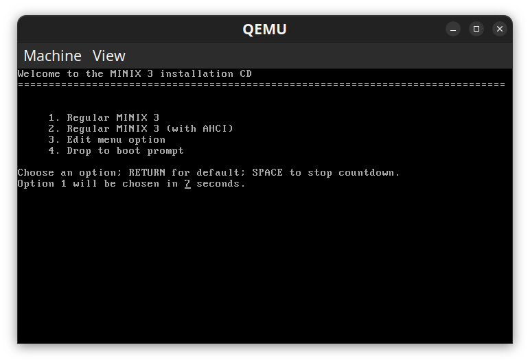

## QEMU v Docker

I chose QEMU because MINIX needs to boot its own kernel and virtual hardware. This also means I can work with the microkernel, page tables and drivers directly.

Docker shares the host Linux kernel, so it is not really suitable for this kind of MINIX work.

---

## Step 1 — Installation

Install QEMU and download the MINIX 3.3.0 ISO.

```bash id="ro6j7r"
sudo apt install qemu-system-x86

wget http://download.minix3.org/iso/minix_R3.3.0-588a35b.iso.bz2

bunzip2 minix*.bz2
```

---

## Step 2 — Create the MINIX virtual disk

Create an 8GB virtual disk.

```bash id="iu1zzl"
qemu-img create -f raw minix3_dev.img 8G
```

---

## Step 3 — Boot MINIX

Create a virtual machine with 1GB of memory. 512MB may also be enough.

Boot from the MINIX ISO:

```bash id="8es8h5"
qemu-system-i386 \
  -m 1024 \
  -drive file=minix3_dev.img,format=raw \
  -cdrom minix_R3.3.0-588a35b.iso \
  -boot d
```

---

## Step 4 — Install MINIX

On the boot screen, select option 1. It may take a while.



When the login prompt appears, log in as `root`, then run:

```bash id="kni4na"
setup
```

Follow the installer and select the virtual disk created earlier.

Once the installation has finished:

```bash id="5bi3jz"
poweroff
```

---

## Step 5 — Network Setup

I recommend getting the network working before doing much else.

I first tried the Intel PRO/1000 Gigabit adapter:

```bash id="fo8n3x"
qemu-system-i386 \
  -cpu host \
  -m 1024 \
  -enable-kvm \
  -machine hpet=off \
  -drive file=minix3_dev.img,format=raw,if=ide \
  -nic user,model=e1000 \
  -boot c
```

I could only get it working properly with the AMD LANCE:

```bash id="f4e2nm"
qemu-system-i386 \
  -cpu host \
  -m 1024 \
  -enable-kvm \
  -machine hpet=off \
  -drive file=minix3_dev.img,format=raw,if=ide \
  -nic user,model=pcnet \
  -boot c
```

In MINIX, run:

```bash id="tgzmo7"
netconf
```

For `model=pcnet`, select option 9, **AMD LANCE**.

I also had to configure the network and DNS manually.

### QEMU network

QEMU user-mode networking uses:

| Address       | Description          |
| ------------- | -------------------- |
| `10.0.2.0/24` | QEMU virtual network |
| `10.0.2.2`    | Virtual gateway      |
| `10.0.2.3`    | Virtual DNS server   |

### My MINIX configuration

```text id="etxd4f"
IP:       10.0.2.15
Netmask:  255.255.255.0
Gateway:  10.0.2.2
DNS:      10.0.2.3
```

Set the DNS server manually:

```bash id="wkft2u"
echo "nameserver 10.0.2.3" > /etc/resolv.conf
```

---

## Step 6 — MINIX package setup

In the MINIX terminal:

```bash id="pzhkf6"
pkgin update
pkgin_sets
```

`pkgin_sets` installs the development tools needed for building MINIX kernel.
